# Experiment 1

## Aim
To design and implement a Library Management System database using appropriate tables, primary keys, foreign keys, and constraints, and to perform DML operations along with DCL commands such as role creation, privilege granting, and revoking to ensure database security.

## Objectives
To gain practical experience in implementing Data Definition Language (DDL), Data Manipulation Language (DML), and Data Control Language (DCL) operations in a real database environment. This will also include implementing role-based privileges to secure data.

---

## Practical/Experiment Steps
* Created table BOOKS to store book details including BOOK_ID, BOOK_NAME, and AUTHOR_NAME.
* Created another table LIBRARY_VISITORS to manage member information with fields for USER_ID, NAME, AGE, and EMAIL.
* Another table BOOK_ISSUE designed to link books and visitors, representing the borrowing process.
* Primary keys are established for each table to uniquely identify various records.
* Constraints are also applied to validate the age is greater than 17, and to prevent duplicates in the email attribute.
* Using INSERT statement to add new records in tables, UPDATE statement to correct the records or attributes and DELETE statement for deleting records.
* A new role of Librarian is created to manage the tables. Various privileges can be given using GRANT and the same can be removed using REVOKE.


---

## Procedure
1. Start the computer system.
2. Open the software (i.e. PostgreSQL, MySQL etc.) and login.
3. Create or select the database you wish to work in.
4. Write appropriate SQL commands to execute the required tasks.
5. Execute the commands.
6. Verify the output.
7. Note down the results and take screenshots for record.

---

## I/O Analysis

### 1. Table Creation: BOOKS
**Input:**
```sql
CREATE TABLE BOOKS(
    BOOK_ID INT PRIMARY KEY,
    BOOK_NAME VARCHAR(20) NOT NULL,
    AUTHOR_NAME VARCHAR(20) NOT NULL,
    BOOK_COUNT INT CHECK(BOOK_COUNT > 0) NOT NULL
);
```

**Output:**


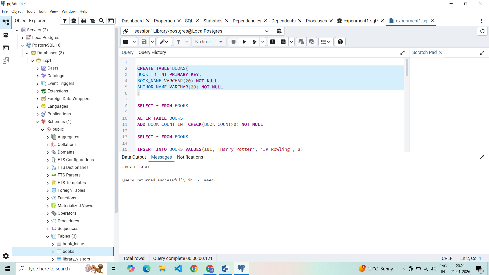

### 2. Insert and Select: BOOKS
**Input:**
```sql
INSERT INTO BOOKS VALUES(101, 'Harry Potter', 'JK Rowling', 3);
SELECT * FROM BOOKS;
```

**Output:**


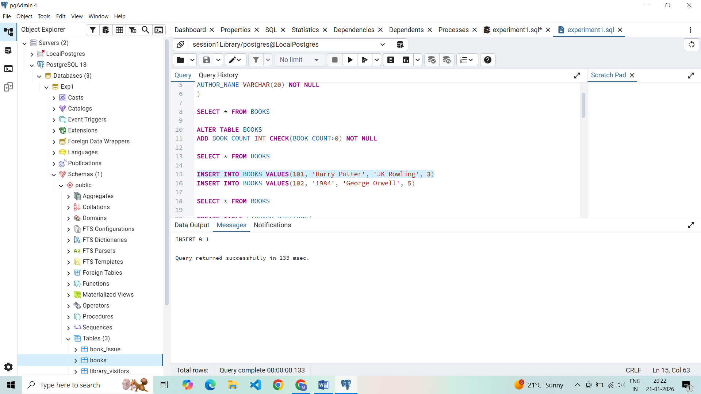
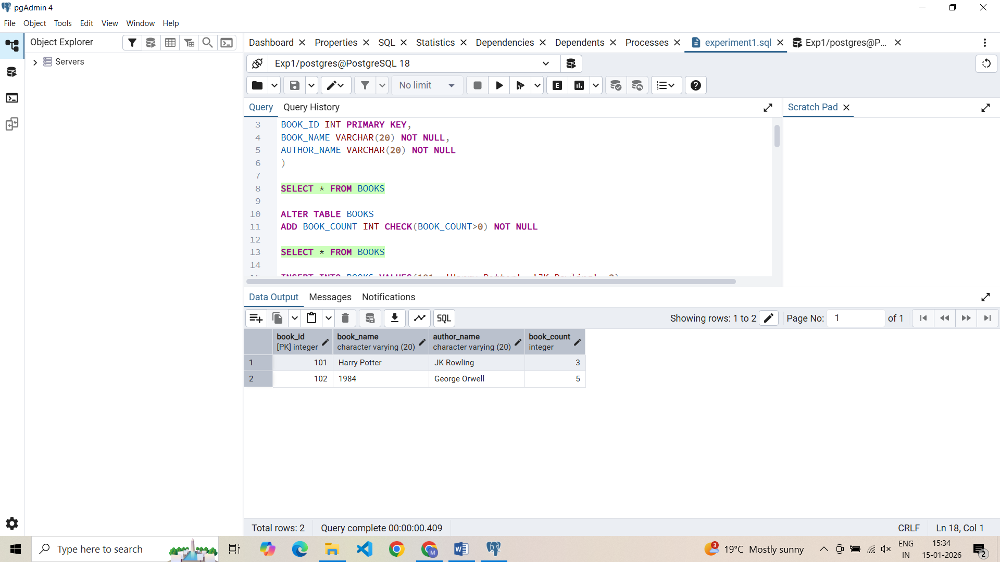

### 3. Table Creation: LIBRARY_VISITORS
**Input:**
```sql
CREATE TABLE LIBRARY_VISITORS(
    USER_ID INT PRIMARY KEY,
    NAME VARCHAR(20) NOT NULL,
    AGE INT CHECK(AGE >= 17) NOT NULL,
    EMAIL VARCHAR(20) NOT NULL UNIQUE
);
```

**Output:**


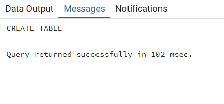

### 4. Insert and Select: LIBRARY_VISITORS
**Input:**
```sql
INSERT INTO LIBRARY_VISITORS(USER_ID, NAME, AGE, EMAIL)
VALUES(101, 'Vansh Sharma', 18, 'vansh12@gmail.com')
SELECT * FROM LIBRARY_VISITORS
```

**Output:**


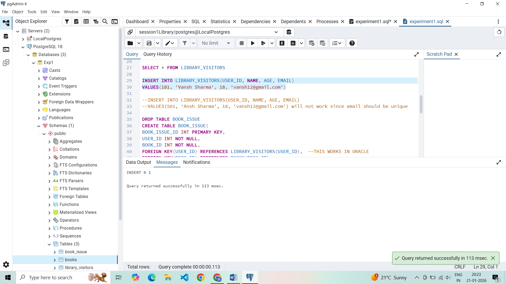
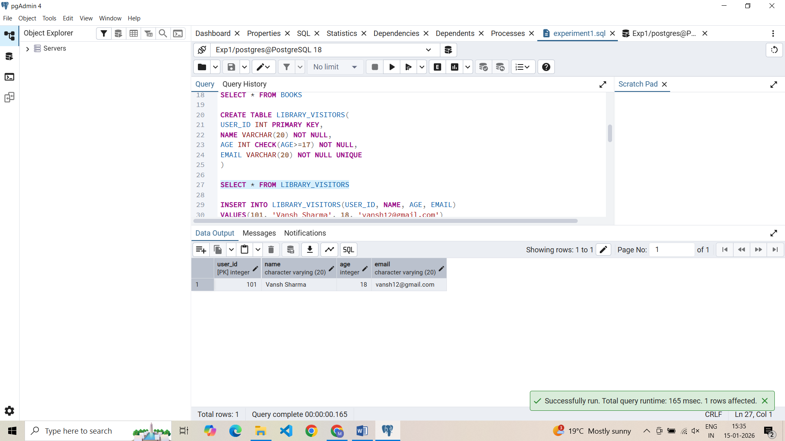

### 4. Table Creation: BOOK_ISSUE
**Input:**
```sql
CREATE TABLE BOOK_ISSUE(
    BOOK_ISSUE_ID INT PRIMARY KEY,
    USER_ID INT NOT NULL,
    BOOK_ID INT NOT NULL,
    FOREIGN KEY(USER_ID) REFERENCES LIBRARY_VISITORS(USER_ID),
    FOREIGN KEY(BOOK_ID) REFERENCES BOOKS(BOOK_ID)
);
```

**Output:**


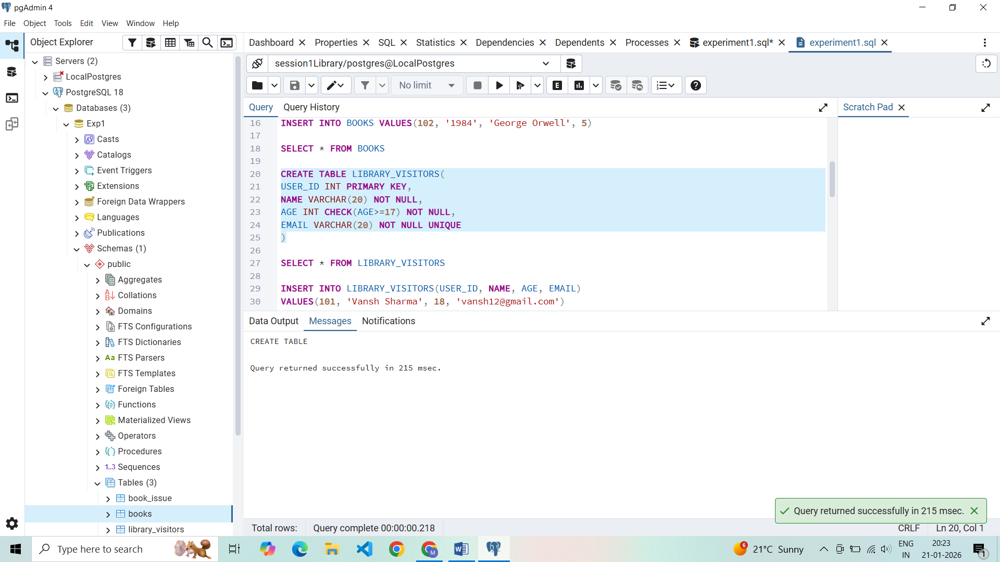

### 4. Insert and Select: BOOK_ISSUE
**Input:**
```sql
INSERT INTO BOOK_ISSUE VALUES(1001, 101, 101, '2026-01-09')
SELECT * FROM BOOK_ISSUE
```

**Output:**


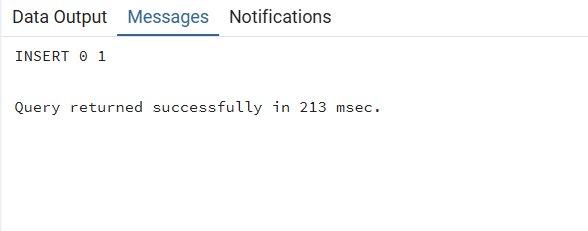
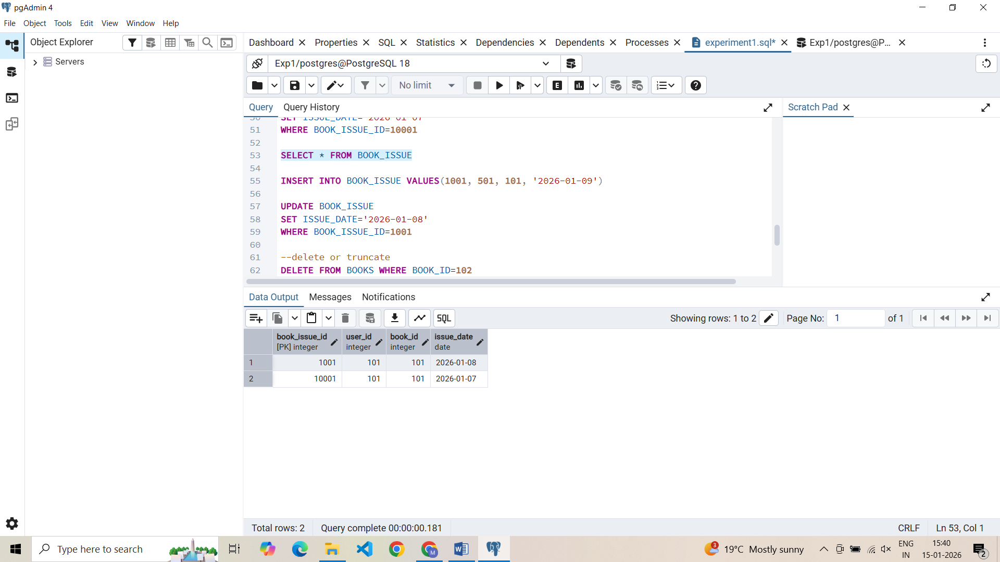


### 5. Creating Roles
**Input:**
```sql
CREATE ROLE LIBRARIAN WITH LOGIN PASSWORD 'mehak1234';
GRANT SELECT, INSERT, DELETE, UPDATE ON BOOKS TO LIBRARIAN;
REVOKE SELECT, INSERT, DELETE, UPDATE ON BOOKS, BOOK_ISSUE, LIBRARY_VISITORS FROM LIBRARIAN;
```

**Output:**


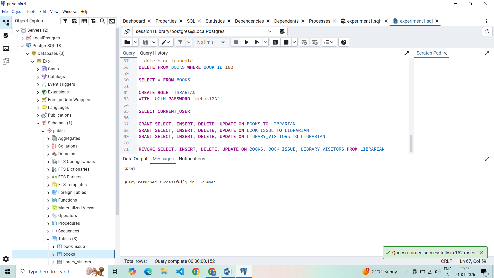
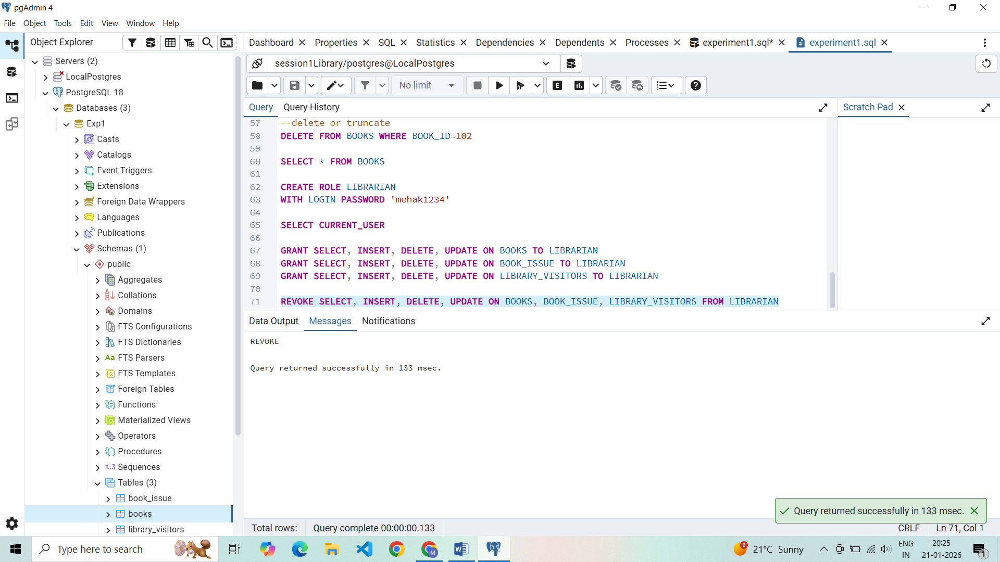

---

## Learning Outcomes
* Gained hands-on experience to work with PostgreSQL and pgAdmin
* Writing queries to create and delete tables
* Learnt to alter tables, view tables, create roles, granting and revoking access to the roles
* Primary and foreign keys implementations and roles

