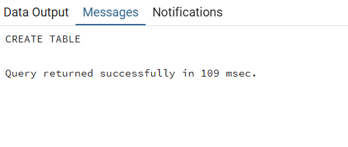
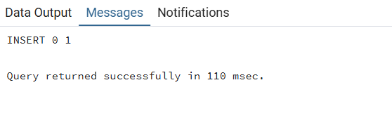
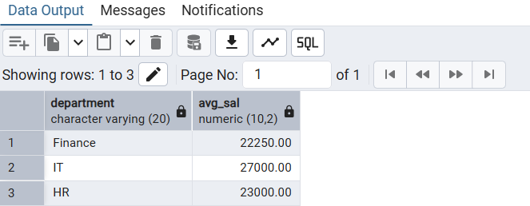
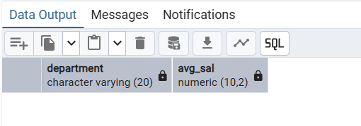

# Experiment 2

## Aim
To understand and implement SQL SELECT queries using various clauses such as WHERE, ORDER BY, GROUP BY, and HAVING to retrieve and manipulate data efficiently from relational database tables.

---

## Objectives
* To practice writing SQL SELECT statements.
* To apply filtering conditions using the WHERE clause.
* To sort query results using the ORDER BY clause.
* To group records using the GROUP BY clause.
* To filter grouped data using the HAVING clause.
* To analyze data using aggregate functions like COUNT(), SUM(), AVG(), MIN(), and MAX().


---

## Practical/Experiment Steps
1.  Created table EMPLOYEE to store workforce details including EMP_ID, EMP_NAME, DEPARTMENT, SALARY, and JOINING_DATE
2.  Established Primary Keys on the EMP_ID column to uniquely identify each employee record within the organization
3.  Added records in the database using INSERT statements to add records across various departments
4.  Calculated average salary using the AVG() aggregate function combined with GROUP BY DEPARTMENT to determine the mean salary for each department
5.  Applied row-level filtering using the HAVING clause to identify specific employees whose individual salaries exceed 20,000
6.  Implemented group-level filtering by using the HAVING clause to display only those departments where the average salary is greater than 30,000
7.  Organized query results using the ORDER BY clause in descending order (DESC) to rank departments from the highest to the lowest average salary


---

## Procedure
1. Start the computer system.
2.	Open the software (i.e. PostgreSQL, MySQL etc.) and login.
3.	Create or select the database you wish to work in.
4.	Write appropriate SQL commands to execute the required tasks.
5.	Execute the commands.
6.	Verify the output.
7.	Note down the results and take screenshots for record


---

## I/O Analysis

### 1. Table Creation: EMPLOYEE
**Input:**
```sql
CREATE TABLE EMPLOYEE(
EMP_ID NUMERIC PRIMARY KEY,
EMP_NAME VARCHAR(20),
DEPARTMENT VARCHAR(20),
SALARY NUMERIC(10,2),
JOINING_DATE DATE
)
```

**Output:**




### 2. Data Insertion: EMPLOYEE
**Input:**
```sql
INSERT INTO EMPLOYEE VALUES(1, 'Aman', 'IT', 30000, '2023-05-23');
INSERT INTO EMPLOYEE VALUES(2, 'Sam', 'IT', 25000, '2016-05-23');
INSERT INTO EMPLOYEE VALUES(3, 'Neha', 'HR', 18000, '2025-09-19');
INSERT INTO EMPLOYEE VALUES(4, 'Suman', 'Finance', 20000, '2021-11-06');
INSERT INTO EMPLOYEE VALUES(5, 'Rohan', 'Finance', 24500, '2023-10-23');
INSERT INTO EMPLOYEE VALUES(6, 'Aditi', 'HR', 28000, '2018-04-16');
INSERT INTO EMPLOYEE VALUES(7, 'Aanya', 'IT', 26000, '2022-07-07')

```

**Output:**




### 3. Getting the average salary of various departments
**Input:**
```sql
SELECT DEPARTMENT, AVG(SALARY)::NUMERIC(10,2) AS AVG_SAL FROM EMPLOYEE
GROUP BY DEPARTMENT

```

**Output:**




### 4. Getting employees with a salary of more than 20000
**Input:**
```sql
SELECT EMP_ID, EMP_NAME, SALARY
FROM EMPLOYEE
GROUP BY EMP_ID
HAVING SALARY>20000

```

**Output:**


### 5. Getting the department with an average salary of more than 30000
**Input:**
```sql
SELECT DEPARTMENT, AVG(SALARY)::NUMERIC(10,2) AS AVG_SAL FROM EMPLOYEE
GROUP BY DEPARTMENT
HAVING AVG(SALARY)>30000


```

**Output:**




### 6. Arranging the departments in increasing order of their average salaries
**Input:**
```sql
SELECT DEPARTMENT, AVG(SALARY)::NUMERIC(10,2) AS AVG_SAL FROM EMPLOYEE
GROUP BY DEPARTMENT
ORDER BY AVG(SALARY) DESC

```

**Output:**


---

## Learning Outcomes
* Learn to filter records using the WHERE clause.
* Group records using GROUP BY.
* Apply conditions on grouped data using HAVING.
* Sort query results using ORDER BY.
